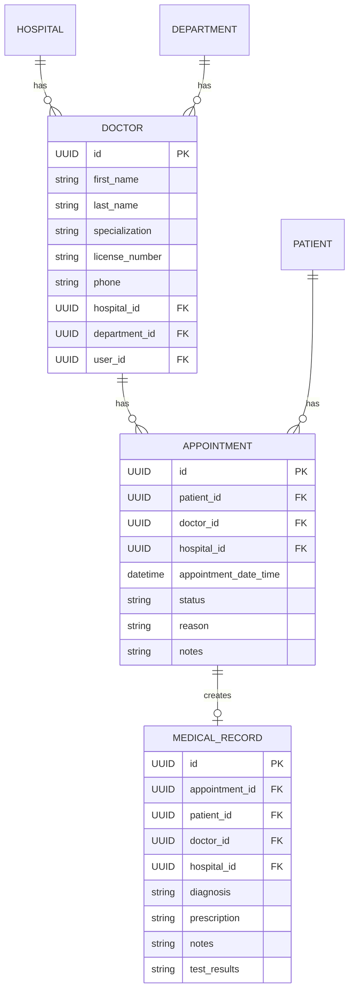

# Module 3: Clinical Operations — Implementation Plan

> **Status:** 🔲 In Progress
> **What it does:** Doctors, Appointments, and Medical Records

---

## What We're Building

| # | Entity | What It Is | Relationships |
|---|--------|-----------|---------------|
| 1 | **Doctor** | A doctor working at a hospital | Belongs to Hospital + Department, linked to a User |
| 2 | **Appointment** | A scheduled visit between a patient and doctor | Links Patient ↔ Doctor, has date/time/status |
| 3 | **MedicalRecord** | A record of a patient visit | Links to Appointment, contains diagnosis/prescriptions/notes |

### How They Connect



---

## New API Endpoints

### Doctors
| Method | URL | Who Can Use | What |
|--------|-----|------------|------|
| POST | `/api/hospitals/{id}/doctors` | HOSPITAL_ADMIN | Register a doctor |
| GET | `/api/hospitals/{id}/doctors` | Any authenticated | List doctors |
| GET | `/api/hospitals/{id}/doctors/{doctorId}` | Any authenticated | Get doctor details |
| PUT | `/api/hospitals/{id}/doctors/{doctorId}` | HOSPITAL_ADMIN | Update doctor |
| DELETE | `/api/hospitals/{id}/doctors/{doctorId}` | HOSPITAL_ADMIN | Deactivate doctor |

### Appointments
| Method | URL | Who Can Use | What |
|--------|-----|------------|------|
| POST | `/api/hospitals/{id}/appointments` | RECEPTIONIST, ADMIN | Book appointment |
| GET | `/api/hospitals/{id}/appointments` | ADMIN, DOCTOR | List appointments |
| GET | `/api/hospitals/{id}/appointments/{apptId}` | Authenticated | Get appointment details |
| PUT | `/api/hospitals/{id}/appointments/{apptId}` | ADMIN, DOCTOR, RECEPTIONIST | Update/reschedule |
| PATCH | `/api/hospitals/{id}/appointments/{apptId}/status` | DOCTOR, ADMIN | Change status (COMPLETED, CANCELLED, etc.) |

### Medical Records
| Method | URL | Who Can Use | What |
|--------|-----|------------|------|
| POST | `/api/hospitals/{id}/medical-records` | DOCTOR | Create a record after visit |
| GET | `/api/hospitals/{id}/patients/{patientId}/medical-records` | DOCTOR, NURSE | Get patient's records |
| GET | `/api/hospitals/{id}/medical-records/{recordId}` | DOCTOR, NURSE | Get specific record |
| PUT | `/api/hospitals/{id}/medical-records/{recordId}` | DOCTOR | Update record |

---

## Files To Create

```
MODELS:
├── model/Doctor.java
├── model/Appointment.java
├── model/AppointmentStatus.java     (enum: SCHEDULED, COMPLETED, CANCELLED, NO_SHOW)
├── model/MedicalRecord.java

REPOSITORIES:
├── repository/DoctorRepository.java
├── repository/AppointmentRepository.java
├── repository/MedicalRecordRepository.java

SERVICES:
├── service/DoctorService.java
├── service/AppointmentService.java
├── service/MedicalRecordService.java

CONTROLLERS:
├── controller/DoctorController.java
├── controller/AppointmentController.java
├── controller/MedicalRecordController.java

DTOs:
├── dto/DoctorDTO.java
├── dto/AppointmentDTO.java
├── dto/MedicalRecordDTO.java

MIGRATIONS:
├── V5__create_doctors_table.sql
├── V6__create_appointments_table.sql
├── V7__create_medical_records_table.sql
```

---

## Verification Plan
1. `./mvnw clean compile` — build succeeds
2. Start app, login as SUPER_ADMIN
3. Create hospital → create hospital admin → create doctor
4. Login as doctor, book appointment
5. Create medical record for the appointment
6. Verify all CRUD operations work
